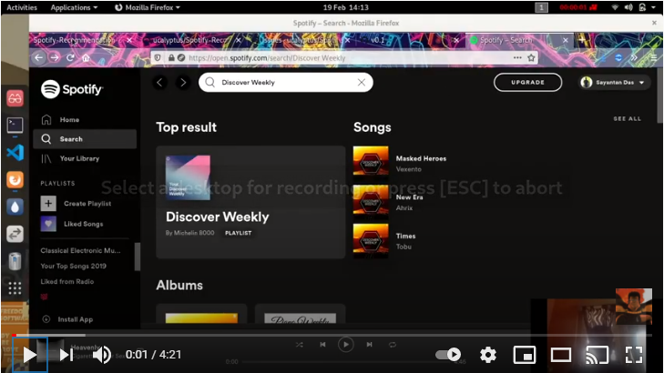

<h1 align="center">Radio Tatuape FM</h1>
 <p align="center">Spotify Recommendation Engine 
	 </p>
<p align="center">
 
</p>

## About the Project:
#### Check my video to understand this project better.

[](https://www.youtube.com/watch?v=otrW8brCAiU)

## Requirements
* spotipy
```bash
 pip install spotipy
```
[Spotify Developer](https://beta.developer.spotify.com/documentation/web-api/) for more info 

## Recommender System:
## [Notebook](https://github.com/ucalyptus/Spotify-Recommendation-Engine/blob/master/Spotify_Recommendation_System_.ipynb) | [Playlist created using the notebook](https://open.spotify.com/playlist/4D8p3hVYwgngTmf1FHol0Y)


